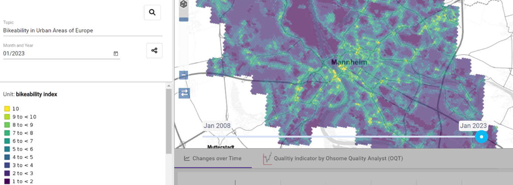
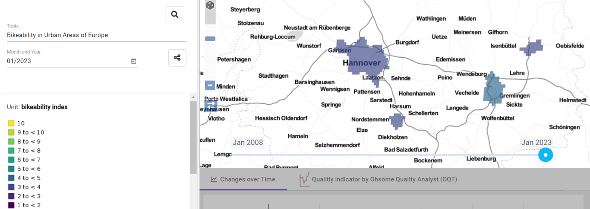
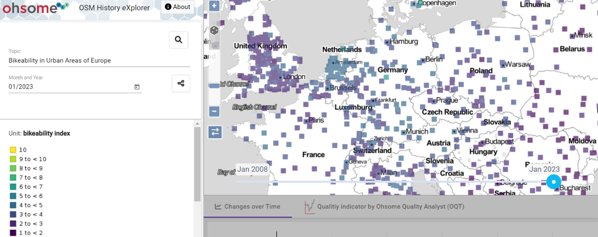
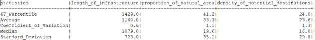

## 1. Introduction

This is a Documentation about the calculation of the so called 'Bikeability-Index'.
There are multiple Definitions in scientific literature for the term 'Bikeability'.\
According to Gehring it describes the suitability of cycling by considering several properties of constructed environment that are capable to promote or hinder cycling (Gehring 2016).

There are many approaches to calculate the Index. In most cases geographic data is used from different sources that are not always accessible for public.\
Heinemann used a different approach in her Bachelor Thesis (Heinemann 2022). Her analysis about bicycle friendliness in Heidelberg relies entirely on open source OSM-Data (ibid.).

Within this workflow, the Bachelor Thesis of Heinemann will be used as a template. Many assumptions made by her are integrated as parameters. \
Especially the adoption of five chosen bikeability indicators that compose the bikeability index characterize this analysis in a deep way.\
However, there are three main improvements in contrast to the origin analysis:\
- The workflow is entirely automatised with R and Python (preparing, downloading, editing, calculating)
- The calculation can be done for multiple timestamps all at once
- The adapted classification standardizes the bikeability index values which enables them to be compared by region and by timestamp.

The Index is calculated only for urban areas that are included in the Global Human Settlement Layer as the chosen bikeability indicators are not suitable for rural areas (Airaghi et al. 2019).\
The results will be visualized in ohsome-hex by hexagons (Figure 1) and shifts to polygons (Figure 2) and centroids (Figure 3) by zooming out further.\
The polygons and centroids depict the urban-aggregated values from the hexagons.\
The index values range from 1 (weak bikeability) to 10 (strong bikeability).

In the following chapters the entire workflow of the analysis is described. Chapter 3 and 4 are only of interests if no access to the ohsome-hex database is available. The aim of this documentation is to get a general idea of how the analysis works and to be able to replicate the core steps.\
All scripts and files that are referred to are accessible via this repository.
 
Figure 1: Visualisation of the Bikeability Index as Hexagons (hex.ohsome.org)

 
Figure 2: Visualization of the Bikeability Index as aggregated city polygons (hex.ohsome.org)

 
Figure 3: Visualization of the Bikeability Index as aggregated city centroids (hex.ohsome.org)

## 2. Indicators
According to Heinemann the Bikeability Index is composed of five indicators:
1.	Length of Infrastructure
2.	Proportion of Natural Area 
3.	Bike Parking Spots 
4.	Seperation from Cars 
5.	Potential Destinations

Each hexagon cell contains the values of all five indicators. But some indicators are calculated by a 100 meter buffer (bike parking spots) or a 250 meter buffer (length of infrastructure, density of potential destinations). Therefore not only the hexagon boundaries need to be created for the analysis but also buffers around their centroids (described in chapter 4). 
Therefore the detailed definition of the bikeability indicators is the following:
-	Length of infrastructure: meters within 250 meter buffer from hexagon centroid
-	Proportion of natural area: area percentage within hexagon
-	Density of bike parking spots: number within 100 meter buffer from hexagon centroid
-	Density of potential destinations: number within 250 meter buffer from hexagon centroid
-	Seperated from cars: number within hexagon

All of these indicators influence the final index in a positive way. Hence, the higher the natural area / bicycle infrastructure / etc. the higher the index.\
The Bikeability Index is the average of the indicators.\
How to calculate an approximated average of the indicators even though they have different units will be explained in chapter 4.1 and 4.2.

The Indicator values are derived from osm geometries filtered by the ohsome-api. The used filters are mainly taken from the study of Heinemann with a few additions. The filters can be examined in the folder filter of the mentioned repository (Kraft 2023).

## 3. Preparation
The calculation of the bikeability index requires some prerequisites:\

### 3.1 Software and Packages
**R**:\
Programming Language with focus on statistical analyses. However, in this analysis it is used to create the hexagons boundaries. For each of these boundaries the Bikeability Index is calculated afterwards.\
The following packages were used:
-	R 4.2.3
-	dggridR 3.0.0
-	rlang 1.1.0
-	sf 1.0-12
-	sp 1.6-0
-	dplyr 1.1.1

**Python**:\
Most commonly used programming language in scientific community. Within this analysis it is used for the automised calculation of the indicator values. For the analysis the following packages were used:
-	Python 3.8.6
-	sqlalchemy 1.4.39   
-	ohsome 0.1.0        
-	pandas 1.5.3
-	geopandas 0.9.0
-	numpy 1.23.4

**PostgreSQL / PostGis**:\
Open-Source Database Management System that enables efficient storage and manipulation of big amount of data.\
Within this analysis it is used to manipulate the calculated indicator values and store the final table with the bikeability index. An access to the ohsome-hex database is necessary.

### 3.2 Global Human Settlement Layer
As already mentioned, OSM data will be the main source of the bikeability analysis.\
However, to clip the bikeability research to urban areas, the Global Human Settlement Layer from the european commission is used (Florzcyk et al. 2019).\
The according shapefile is publicly available for download (European Commission 2020).
The bikeability index is calculated only for european urban areas because urban areas from other continents will require different indicators.\
Therefore the downloaded layer is scaled down to european urban areas (data/boundaries/urban_europe.shp) and then uploaded to postgis.\
The resulting table is called *urban_eu*. 
### 3.3 Hexagons
The hexagons are created by using the r-package *Discrete Global Grids for R* (Barnes & Sahr 2017).\
The chosen resolution level of the hexagon is 20 which corresponds to a cell-center-distance of ~130m.\
The creation is done with the python script *urban_points.py* and the r-script *hexagons.R*. The latter can run only if the former is executed.

Even though the creation of all hexagons is divided in four major european regions (Northern-, Southern-, Western- and Eastern Europe) the script *Hexagon.R* can take a lot of processing time (probably more than 6 hours). The hexagons are created seperatly for four regions because otherwise the random access memory is overloaded and the program may abort.  

The final four shapefiles are uploaded to postgis.\
As mentioned in chapter 2, buffers with sizes of 100 meters and 250 meters around the hexagon-centers are needed to calculate the indicator values. Both the upload of the hexagons and the supplement of the buffers are executed with the python script *hexagons.py*. In the ohsome-hex database the hexagons are stored in the table *grids.isea3h_europe_cities_res20*.

## 4. Processing 
The processing of the Bikeability Index is done entirely with the python script *process.py*. The script needs to be executed within the repository file structure (https://gitlab.gistools.geog.uni-heidelberg.de/giscience/big-data/ohsome/apps/hex/bikeability) and an access to the ohsome-hex database is necessary.

The script creates the table *bikeability* which includes the bikeability index for each hexagon and timestamp including information about the urban area the hexagon is within.

The core steps of the script *process.py* that require more detailed explanation are the following
-	Transform unclassified indicator values to classified and standardized values\
&#8594;  Chapter 4.1: Classification
-	Calculate the summarizing Bikeability Index from the classified indicator values\
&#8594; Chapter 4.2: Final Bikeability Index
-	Assign an aggregated Bikeability Index to each urban area\
&#8594; Chapter 4.3: Aggregation

During execution, the user has to name the timestamps for which the values will be calculated. Consider that the more timestamps added the longer the execution time.
When the script was executed for 16 timestamps (2008-01-01 until 2023-01-01) it needed around three days.
The execution time is strongly linked to the speed of requests from the ohsome-api and therefore code efficiency is limited. 
At least the program can be aborted and continued another time at the same step. 

The result table is created at the beginning of the program and filled throughout the program run. An abortion, no matter whether by the user or by a bug, will not delete current results. 
By continuing the program and specifying the same timestamps as before, the program will continue calculating the Bikeability Index at the previously aborted state. Specified timestamps that were not calculated previously are calculated for all hexagons again.

It is necessary to mention that if the program is not finished ordinary but aborted, the city aggregation is not executed and two temporary tables are inside the user specified schema. They have to be deleted manually if necessary. The city aggregation can be executed manually with the scripts *join_cities.sql* and *aggregation.sql*.

### 4.1 Classification 
To derive a summarized value from all five indicator values, these values have to be transformed to the same scale. So for each indicator an assumption has to be made when the value is high and when the value is low.

Heinemann did in her Bachelor Thesis the approach to derive the scale from the maximum value of the cells. That works fine by calculating the index for one research area and one timestamp only but not by calculating the index for multiple research areas and multiple timestamps. The reason for this is that the maximum values differ between cities and timestamps (and therefore the scales). 

For this analysis a different approach is made: five regions are used as model regions:
-	Copenhagen
-	Utrecht
-	Amsterdam
-	Muenster
-	Bremen alte Neustadt

These regions are known for their high bicycle friendliness (ADFC 2022; Luco Cover SAS 2022; Stadt Münster 2023; Copenhagenize.eu Design Co. 2019; bremen.online 2022). The exact boundaries can be examined in the ohsome-hex database (*mkraft.bikeability_orientation_boundaries*) or in the folder *data/model_regions* from the attached repository.

The script *orientation.sq*l creates a table that depicts the summarized statistics of the indicator values for these regions. The indicators "density of bike parking spots" and "seperated from cars" are ignored because their values are too small. Their scale will be 10 for existance (number >= 1) and 1 for non-existance (number = 0).\
For the other indicators the statistics are the following:

Example of how to read the table: 
-	For the bikeability indicator "length of infrastructure" the average median from all five model regions is 1.429 meters 
-	For the bikeability indicator "proportion of natural area" the average 67. Percentile from all five model regions is 41.2% 

The challenge of the classification is to derive an appropriate orientation value at which the indicator values are considered as „good“ (or 10 out of 10). Within this analysis the 67. Percentile is used. From this orientation value, ten classes with equal size are created (except the first class as it also includes values higher than the 67. Percentile). The interval length of the other classes are 10% of the 67. Percentile.\
The following example illustrates the classification of the indicator "length of infrastructur":
-	Average 67. Percentile from all five model regions: 1429 meters
-	Interval Length: 1429 meters / 10 = 142.9 meters
-	x ≥ 1286.1 meters (1429 – 142.9) &#8594; 10
-	1286.1 < x ≥ 1143.2 &#8594; 9
-	1143.2 < x ≥ 1000.3 &#8594; 8
-	1000.3 < x ≥ 857.4 &#8594; 7
-	857.4 < x ≥ 714.5 &#8594; 6
-	714.5 < x ≥ 571.6 &#8594; 5
-	571.6 < x ≥ 428.7 &#8594; 4
-	428.7 < x ≥ 285.8 &#8594; 3
-	285.8 < x ≥ 142.9 &#8594; 2
-	142.9 < x ≥ 0 &#8594; 1

The execution of such a classification in the ohsome-hex database is done with the script *classify.sql*. For sure it is possible to choose alternative classification approaches. For example by using the average median as the orientation value instead of the 67. Percentile. Or by removing certain model regions and adding new ones.

By adjusting the script *classify.sql* or the superior script *process.py* it is possible to create a table with unclassified values first. That simplifies to test different classification methods until the range of classified values suits best.

Nevertheless, the recent classification method has already given evidence to appropriate results. But certainly suggesting alternative classification methods that may lead to better results is always welcomed.

### 4.2 Final Bikeability Index 
The classified values for the five bikeability indicators can be summarized to the final bikeability index. The following example illustrates the calculation:
-	Hexagon-ID: 3295746
-	Timestamp: 2022-01-01
-	Classified indicator values:
    - Length of infrastructure: 2
    - Proportion of natural area: 2
    - Seperated from cars: 1
    - Density of potential destinations: 8
    - Density of bike parking spots: 1
-	Bikeability-Index: (2 + 2 + 1 + 8 + 1) / 5 = 2.8

&#8594;The hexagon with the ID: 3295746 has got a bikeability value of 2.8 at the timestamp 2022-01-01

### 4.3 Aggregation 
To obtain information about the summarized bikeability of any urban area, the hexagon cells need information of the urban area they are within.\
To do so, the city id‘s and the city names from the table *urban_eu* (see chapter 3.2) are spatially joined to the bikeability table with the script *join_cities.sql*. 

The updated table *bikeability* enables to group the bikeability values by cities. The implementation is done with the script *aggregation.sql* which creates a new table *bikeability_aggregated* that  stores the geometries of the cities (polygon and centroid) and their aggregated bikeability values. 

The table *bikeability_aggregated* enables the visualisation of the bikeability values by cities in the ohsome hex dashboard and makes comparisons between cities possible by zooming out. 

## 5. Discussion
The described analysis of the bikeability index enables a powerful comparison of the bikeability between timestamps and regions.\
Scientific literature is used as a template for thematic assumptions (e.g. the decision of appropriate indicators and the according osm filters).\
Previous studies are extended by implementing an automated workflow to calculate the final index.\
Both the data sources (OpenStreetMap, Global Human Settlement Index) and processing tools (Python, R, Ohsome-API, PostGis) are open source and enable simple replication.

However, there are some limitations that has to be mentioned.\
The fundamental data source is OpenStreetMap (OSM) and the calculation of the bikeability values already starts at 2008. In the early stages of OSM the mapping completeness was limited and therefore geographic objects that contribute to higher bikeability values are missing. An increase of bikeability values over time is dominantely caused due to an increase of mapped geobjects rather than an increase of real world bikeability.

Furthermore, suitable indicators for bikeability differ in literature and an overall common thinking within scientific community is not yet detectable. Upcoming researches might falsify recent assumptions that are currently used as a templates.

Even if the chosen indicators depict real world bikeability in the best way, the representation of according osm objects is still a challenge. Osm tags (or attributes) are not standardized and mappers can set their own uncommon attributes. That challenges the filter implementation as these filters rely on common (inofficially) standardized osm tags. Inspecting the filters and report missing or outdated tags is always welcome and will improve the analysis. 

It is also important to mention that osm data is not suitable for all kinds of important information with regard to bikeability. For example, the analysis could strongly benefit from motor traffic intensity as the amount and the speed of driving motor vehicles definetely decrease the motivation to cycle. Unfortunately, road attributes about speed limits and motor vehicle frequency is barely available in OSM and extending the analysis with this bikeability indicator is not possible.\
However, extending the analysis with other data sources might solve this problem but that contradicts with the general interest of open source based analyses. 

## 6. Conclusion
The Bikeability-Index describes the suitability of cycling by considering several properties of constructed environment that are capable to promote or hinder cycling (Gehring 2016).\
To calculate the Index, underlying thematic assumptions have to be made with regard to appropriate bikeability indicators and osm filters. To do so, the previous study from Heinemann is used as a template (Heinemann 2022). 

However, this analysis extends current calculations by implementing a mainly automatised workflow to calculate the index.\
Furthermore, the updated classification enables comparisons between multiple cities and timestamps. Both the data sources and the processing tools are open source and enable simple replication. Everything a user needs is an internet connection, the Global Human Settlement Layer (GHSL), an accessible postgis database, R and python.

The underlying assumptions for the calculations can still be modified and suggested improvements are always welcome, especially with regard to the osm filters and the classification method. 

Nevertheless, the current state of the analysis already increases knowledge of spatial bikeability distribution, both at a small scale within urban areas and at a high scale between european cities

## 7. Sources

- Allgemeiner Deutscher Fahrrad Club. (2022). Utrecht: In zehn Jahren zur Fahrradstadt der Superlative. Von https://www.adfc.de/artikel/utrecht-in-zehn-jahren-zur-fahrradstadt-der-superlative abgerufen\
- Barnes, R., & Sahr, K. (2017). dggridR: Discrete Global Grids for R. R package version 2.0.4. Von “https://github.com/r-barnes/dggridR/ abgerufen
- bremen.online. (2022). Deutschlands erste Fahrradzone in Bremen. Wirtschaftsförderung Bremen GmbH. Abgerufen am 29. 08 2023 von https://www.bremen.de/leben-in-bremen/fahrradstadt-bremen/fahrradzone
- Copenhagenize.eu Design Co. (2019). https://copenhagenizeindex.eu. Abgerufen am 29. 08 2023 von https://copenhagenizeindex.eu/the-index
- European Commission. (2020). GHSL - Global Human Settlement Layer. (E. Commission, Herausgeber) Abgerufen am 01. 09 2023 von https://ghsl.jrc.ec.europa.eu/ghs_stat_ucdb2015mt_r2019a.php
Florcyk, A., Corbane, C., Schiavina, M., Pesaresi, M., Maffenini, L., Melchiorri, M., . . . Zanchetta, L. (2019). GHS-UCDB R2019A 
- GHS Urban Centre Database 2015, multitemporal and multidimensional attributes. Abgerufen am 29. 08 2023 von https://data.jrc.ec.europa.eu/dataset/53473144-b88c-44bc-b4a3-4583ed1f547e
- Gehring, D. (2016). Bikeability-Index für Dresden - Wie fahrradfreundlich ist Dresden. Masterarbeit an der Professur für Verkehrsökologie, TU Dresden, Verkehrsökologie. Von http://nbn-resolving.de/urn:nbn:de:bsz:14-qucosa-201073 abgerufen
- Heinemann, M. (2022). Radfreundlichkeit in der Stadt. Umsetzung eines Bikeability-Index auf Basis von OpenStreetMap am Beispiel Heidelberg. Heidelberg Institute for Geoinformation Technology, Geographie, Heidelberg.
- Kraft, M. (2023). Bikeability. Von https://gitlab.gistools.geog.uni-heidelberg.de/giscience/big-data/ohsome/apps/hex/bikeability abgerufen
- Luko Cover SAS. (2022). Global Bicycle Cities Index 2022 - the most cyclist-friendly cities around the world, based on data. Abgerufen am 29. 08 2023 von https://de.luko.eu/en/advice/guide/bike-index/
- Stadt Münster. (24. 4 2023). ADFC-Fahrradklima-Test: Münster belegt Spitzenplatz. Abgerufen am 29. 08 2023 von https://www.stadt-muenster.de/aktuelles/pm-details?1127264

